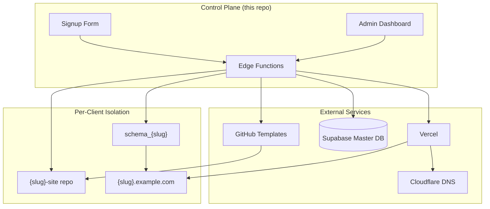

# Altay Studio

> [!CAUTION]
> This repository is a living snapshot of software under ongoing development. The public source code is updated as the work evolves and matures.
>
> It may contain incomplete features, known limitations, bugs, or security vulnerabilities. Do not deploy this snapshot to production or use it with real user data, payments, credentials, or other sensitive information without an independent security review.

**Automated website factory — isolated tenant provisioning at scale.**

Altay Studio is a SaaS control plane that provisions, deploys, and manages isolated business websites. Each client receives their own database schema, GitHub repository, and Vercel deployment — not a shared multi-tenant monolith.

---

## Architecture



### Provisioning pipeline

When a business submits the launch form, the `provision-client` edge function runs an ordered pipeline:

1. **Authenticate** — verify the user's JWT
2. **DB record** — insert into `public.businesses`
3. **Schema** — create `schema_{slug}` and apply template SQL
4. **GitHub** — generate a private repo from the selected template
5. **Config inject** — write `tenant.config.json` via GitHub Contents API
6. **Vercel** — create project, inject env vars, assign subdomain
7. **DNS** — wildcard CNAME handles routing automatically
8. **Complete** — persist deployment URL and mark status done

See [AGENTS.md](./AGENTS.md) for the full governance document, architectural invariants, and agent operating rules.

---

## Headless Block Architecture

Reusable features live in [`blocks/`](./blocks/) as self-contained units:

| Artifact | Purpose |
|----------|---------|
| `schema.sql` | Database plumbing and RLS |
| `engine.ts` | Headless React hook for state and API |
| `instructions.md` | AI prompt for bespoke Tailwind skins |

The control plane composes tenant sites by injecting blocks rather than copying monolithic codebases. See [`blocks/README.md`](./blocks/README.md) and [`MODULES.md`](./MODULES.md) for the full manifest.

---

## Project structure

```
altay-studio/
├── blocks/              # Reusable headless feature blocks
├── src/                 # Control plane React app (signup, admin, CRM)
├── supabase/
│   ├── functions/       # Edge Functions (provision-client, admin-action, agent-director)
│   └── migrations/      # Platform schema migrations
├── scripts/             # Operational helpers (provisioning tests, schema apply)
├── docs/                # Platform documentation
├── AGENTS.md            # AI agent governance & architectural contracts
└── .env.example         # Required secrets (placeholders only)
```

---

## Tech stack

| Layer | Technology |
|-------|------------|
| Frontend | React 19, Vite, TypeScript, Tailwind CSS, shadcn/ui |
| Backend | Supabase (Postgres, Auth, Edge Functions, RLS) |
| Deploy | Vercel (per-tenant projects) |
| DNS | Cloudflare wildcard CNAME |
| Templates | GitHub Generate API → private repos |
| Agent OS | Claude ReAct loop via `agent-director` edge function |

---

## Getting started

### Prerequisites

- Node.js 20+
- Supabase CLI (`npx supabase`)
- Accounts with GitHub, Vercel, and Supabase

### Setup

```bash
npm install
cp .env.example .env.local   # fill in your own credentials
npm run dev
```

Configure Supabase Edge Function secrets separately:

```bash
npx supabase secrets set GITHUB_TOKEN=... VERCEL_API_TOKEN=... --project-ref [YOUR_SUPABASE_PROJECT_REF]
```

### Build

```bash
npm run build
```

### Try provisioning

`scripts/provision-test-tenants.mjs` exercises the full provisioning pipeline against real GitHub/Vercel/Supabase accounts (configured via `.env.local`) — useful for verifying the pipeline end-to-end without going through the signup UI.

---

## Template contract

Every template repository must include:

- `altay.config.json` — metadata, build commands, required env vars
- `supabase/schema.sql` — full schema with RLS
- `.env.example` — documented environment variables
- `vercel.json` — SPA routing rewrites
- `src/lib/supabase.ts` — dynamic Supabase client

Register new templates in `src/constants.ts` under `TEMPLATE_MAP`.

---

## Agent governance

This project uses structured AI agent workflows. All agents must read and follow [AGENTS.md](./AGENTS.md) before making changes. It covers:

- Provisioning flow ordering (critical — do not reorder steps)
- PostgREST schema exposure rules
- Block extraction protocol
- Template contract requirements
- Known platform gotchas and fixes

---

## License

MIT — see [LICENSE](./LICENSE). This repository is a sanitized public extract from a private working monorepo, published for portfolio and demonstration purposes. Client names, credentials, and proprietary content have been replaced with placeholders or demo fixtures.
